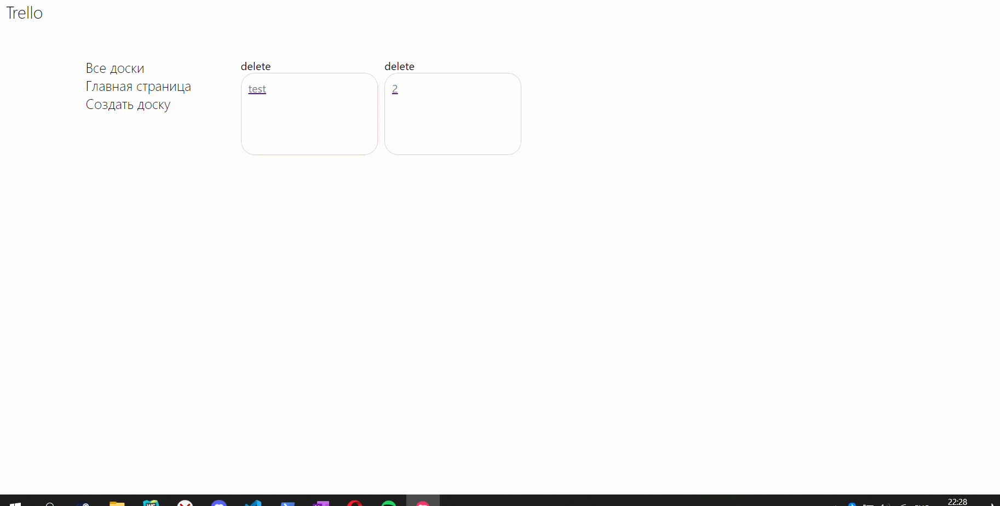

# TRELLO
# В работе использовались:
- TypeScript,
- React/Redux redux-thunk,
- Styled-components,

# Функционал:
- Добавление / Удаление досок,
- Добавление / Удаление Колонок задач,
- Добавление / Удаление Задач,
- D&D задач между колонками,
- Регистрация / Логин / Авторизация по токену,

# Демо
https://sabfes.github.io/Trello/
# Установка
Перед началом работы необходимо проверить наличие установленного node.js и npm
Скопируйте проект на компьютер:
```
git clone https://github.com/Sabfes/yandex-avtoru.git
```
Установите зависимости:
```
npm install
```

# Работа

Для локальной разработки с поднятием сервера используйте:

```
npm start
```

Для сборки версии в продакшн:

```
npm run build
```
